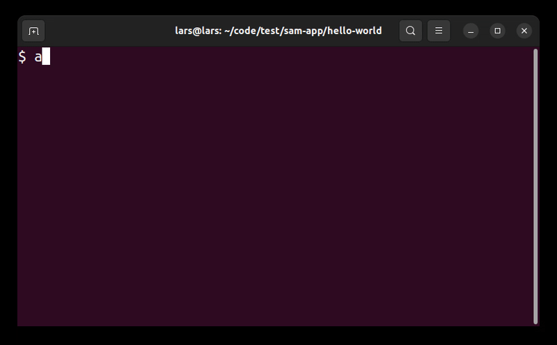

# AWS SDK v3 CLI

The AWS SDK v3 for Javascript is becoming the standard SDK for Javascript developers. However, due to [inconsistent naming](https://twitter.com/lajacobsson/status/1661103472446513152), it is not easy to find the service clients you need without going through the [documentation](https://docs.aws.amazon.com/AWSJavaScriptSDK/v3/latest/index.html).

This is a command-line interface (CLI) tool for the AWS SDK v3. It allows you to search for aws-sdk-js service clients using free text search.


## Prerequisites

Before using this CLI tool, make sure you have the following:

- Node.js installed on your system.
- An environment variable named `GITHUB_TOKEN` set with your GitHub personal access token. You can create one [here](https://github.com/settings/tokens).

## Installation

To install the tool, run the following command:

```shell
npm install -g aws-sdk-v3-cli
```

## Usage

Run the CLI tool using the following command:

```shell
awssdk [options]
```

### Options

The CLI tool supports the following options:

- `--no-cache`: Use this option to disable cached results. By default, the tool uses cached results to improve performance. If you want to refresh the results, run the command with `--no-cache`.

### Example

```shell
awssdk --no-cache
```

## License

This project is licensed under the MIT License. See the [LICENSE](LICENSE) file for details.
